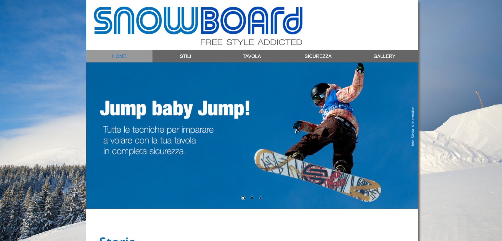
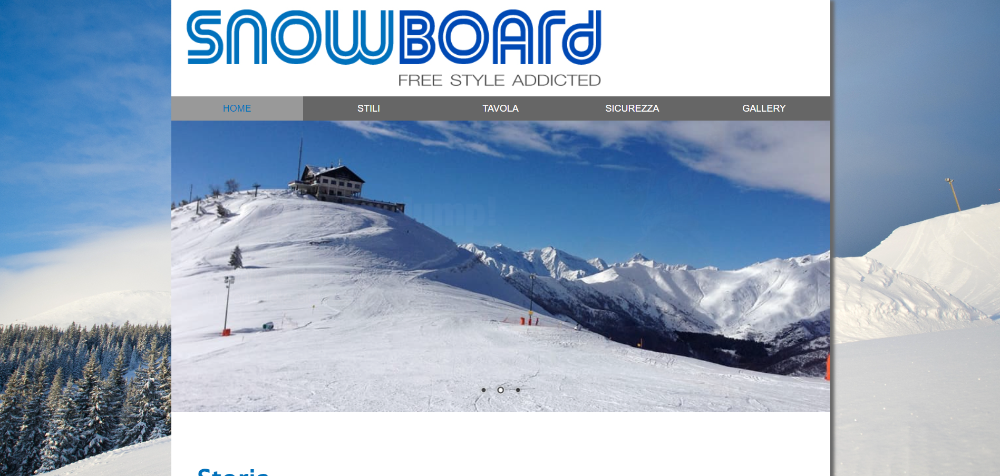
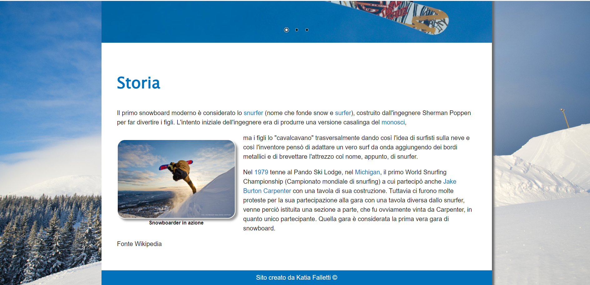
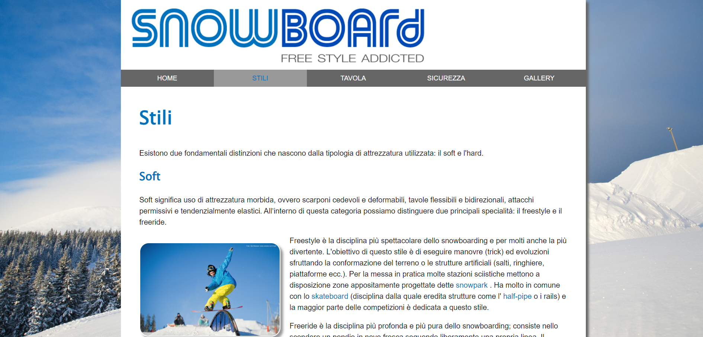
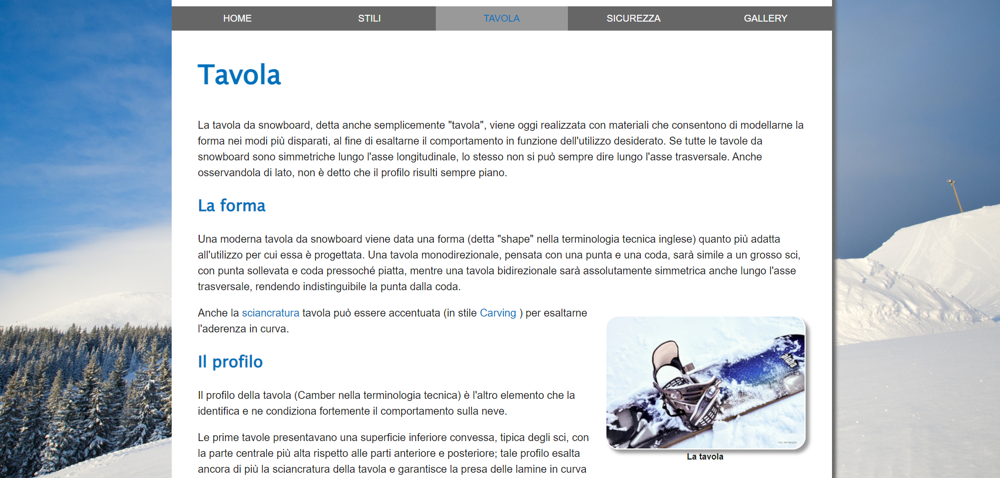
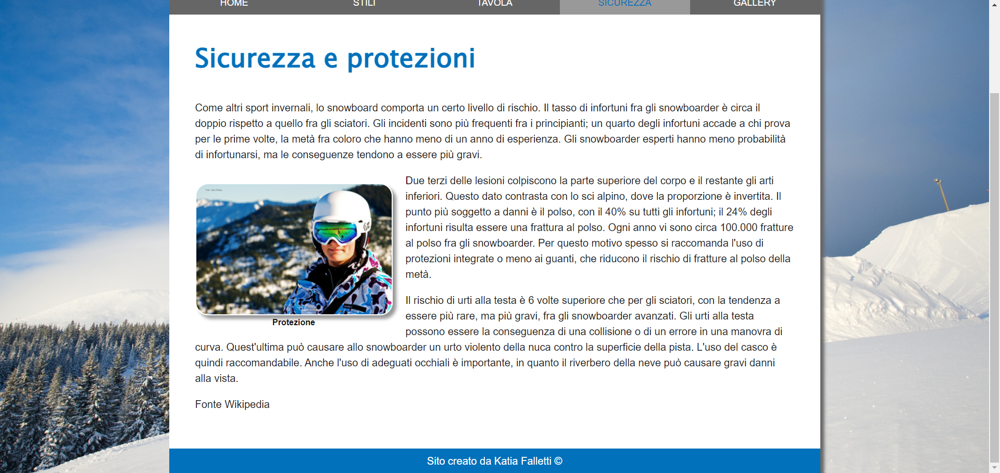
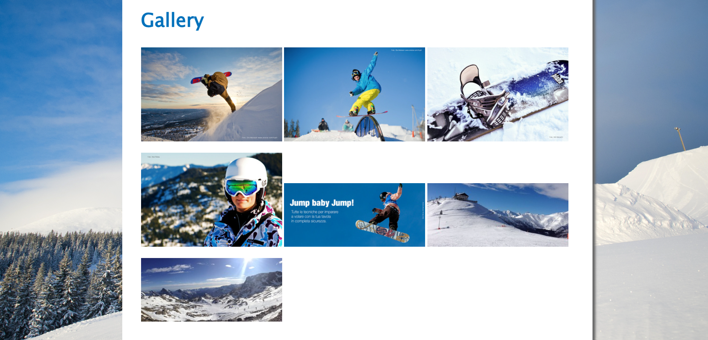
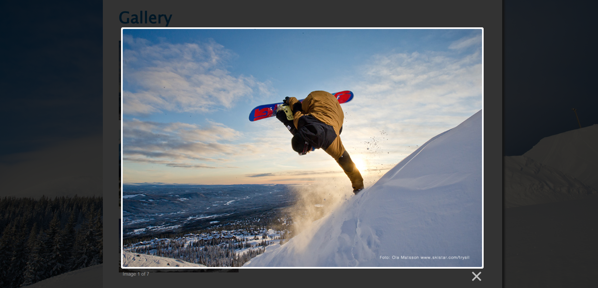

# Sito snowboard

Questo progetto è un sito web che tratta dello snowboard fornisce informazioni sulle tecniche avanzate di snowboard, gli stili, le varietà di tavole disponibili e consigli sulla sicurezza sulle piste.

## Descrizione

Questo progetto che simula un sito web sullo snowboard è stato realizzato con HTML CSS e alcune librerie di JavaScript quali nivo slider e lightbox. 

## Funzionalità

La web app include le seguenti funzionalità:

- Carosello animato
- foto interattive
- gallery interattiva
- sito responsive per smartphone e tablet

## Tecnologie utilizzate

La web app è stata sviluppata utilizzando le seguenti tecnologie:

- HTML
- CSS
- Librerie JavaScript: lightbox e nivoslider

## Licenza

<!-- Questo progetto è stato rilasciato sotto la licenza MIT. Per ulteriori informazioni, leggere il file `LICENSE.md`. -->

## Crediti

Questo progetto è stato sviluppato da Katia Falletti.(https://it.linkedin.com/in/katia-falletti-616890225?trk=people-guest_people_search-card)
